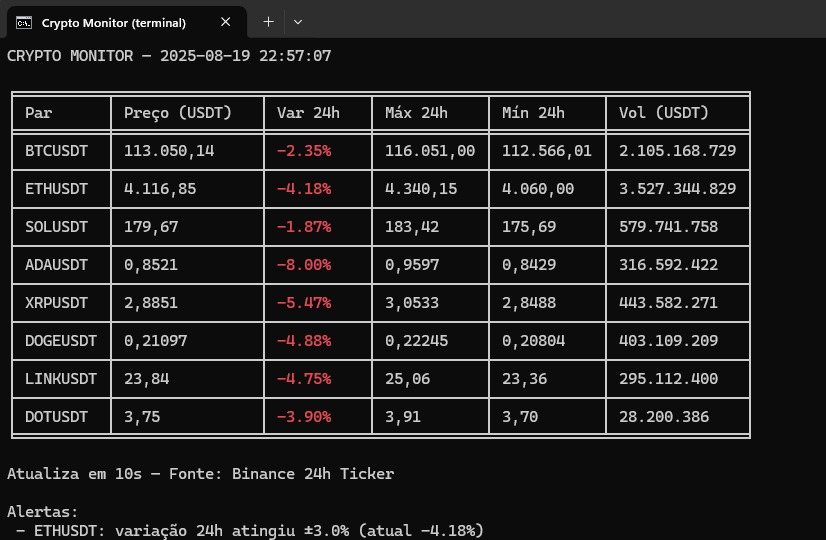

# 🚀 Crypto Monitor Simple

[](https://www.python.org/downloads/)
[](LICENSE)

Um monitor simples e privado de criptomoedas no terminal, usando a **API pública da Binance**.  
Feito em Python com suporte a execução direta no Windows via `.bat`.

---

## 📸 Preview

> Exemplo ilustrativo de saída (valores fictícios):

| Par     | Preço (USDT) | Var 24h | Máx 24h | Mín 24h | Vol (USDT) |
|:--------|-------------:|--------:|--------:|--------:|-----------:|
| BTCUSDT | 113.227,95   | +0,27%  | 115.000 | 111.500 | 2.453.000  |
| ETHUSDT | 4.100,78     | +0,57%  | 4.250   | 3.950   |   856.000  |

### Exemplo real (terminal rodando):
<p align="center">
  
</p>

---

## ⚙️ Instalação e uso

### Requisitos
- [Python 3.9+](https://www.python.org/downloads/)
- Dependências:
  ```bash
  pip install requests tabulate
